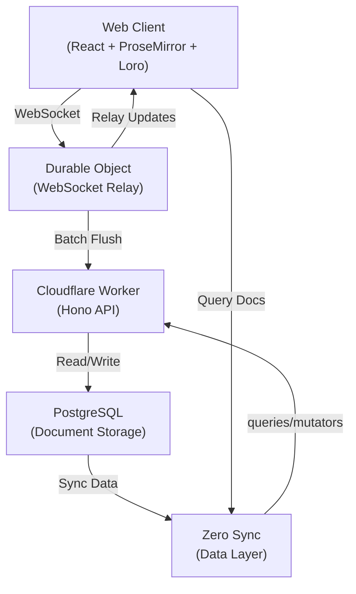

# Concord

> ⚠️ **Pre-Alpha Demo** — Experimental reference for building multiplayer apps like Notion/Google Docs. Not for production.

Real-time collaborative editor using [ProseMirror](https://prosemirror.net), [Loro CRDT](https://loro.dev), [Zero](https://rocicorp.dev/zero), and [Cloudflare Durable Objects](https://developers.cloudflare.com/durable-objects/).

https://github.com/user-attachments/assets/abe82973-426c-4bdb-97b1-158bb1381426

## Architecture



## Quick Start

```bash
pnpm install && pnpm dev
# Open http://localhost:5173
```

### Environment

**Root `.env`:**
```bash
VITE_API_URL=http://localhost:8787
VITE_WEB_URL=http://localhost:5173
VITE_ZERO_URL=http://localhost:4848
VITE_WS_URL=ws://localhost:8787
```

**`apps/cf-api/.dev.vars`:** (see [GitHub OAuth setup](https://github.com/settings/developers))
```bash
GITHUB_CLIENT_ID=your_client_id
GITHUB_CLIENT_SECRET=your_client_secret
BETTER_AUTH_URL=http://localhost:8787
BETTER_AUTH_SECRET=generate-a-random-secret
CORS_ORIGINS=http://localhost:5173,http://localhost:4848,http://localhost:8787
TRUSTED_ORIGINS=http://localhost:5173,http://localhost:8787,http://localhost:4848
```

### Test Multiplayer

```bash
pnpm -f web simulate:auth  # First time only
pnpm -f web simulate       # Run 4 concurrent clients
```

## How It Works

1. User types → ProseMirror transaction → Loro CRDT update
2. Update sent via WebSocket to Durable Object
3. DO broadcasts to other clients + buffers in DO storage
4. Alarm flushes buffered updates to PostgreSQL every 20s
5. Zero syncs document list to all clients

## License

MIT
