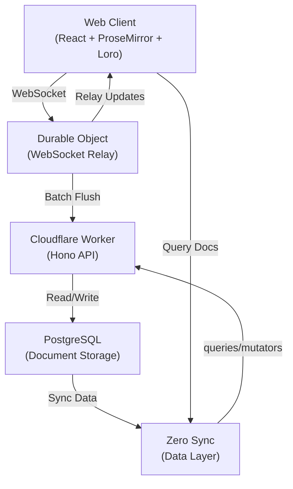

# Concord

> ⚠️ **Pre-Alpha Demo** — This is an experimental reference implementation showcasing how modern multiplayer applications like Notion and Google Docs can be built using today's cutting-edge technologies. Not intended for production use.

A real-time collaborative document editor built with [ProseMirror](https://prosemirror.net), [Loro CRDT](https://loro.dev), [Zero sync engine](https://rocicorp.dev/zero), and [Cloudflare Durable Objects](https://developers.cloudflare.com/durable-objects/). Supports concurrent multi-user editing with conflict-free synchronization.


https://github.com/user-attachments/assets/abe82973-426c-4bdb-97b1-158bb1381426


## Architecture



## Key Features

- **Real-time Collaboration**: Multiple users editing the same document simultaneously
- **CRDT Sync**: Conflict-free updates using Loro CRDT
- **Authentication**: GitHub OAuth via Better Auth
- **Persistence**: Document updates saved to PostgreSQL
- **WebSocket Relay**: Durable Objects coordinate real-time updates across clients

```

## Getting Started

### Environment Setup

#### 1. Root `.env` file (client-side config)

Create a `.env` file in the project root with these variables:

```bash
# Frontend URLs (all VITE_* vars are exposed to the web app)
VITE_API_URL=http://localhost:8787      # Backend API
VITE_WEB_URL=http://localhost:5173      # Frontend app
VITE_ZERO_URL=http://localhost:4848     # Zero sync server
VITE_WS_URL=ws://localhost:8787         # WebSocket endpoint
```

For production, update these to your deployed URLs.

#### 2. Worker secrets (`apps/cf-api/.dev.vars`)

Create `.dev.vars` in `apps/cf-api/` for local development:

```bash
# GitHub OAuth (create app at https://github.com/settings/developers)
GITHUB_CLIENT_ID=your_github_client_id
GITHUB_CLIENT_SECRET=your_github_client_secret

# Better Auth
BETTER_AUTH_URL=http://localhost:8787
BETTER_AUTH_SECRET=generate-a-random-secret

# CORS configuration (comma-separated origins)
CORS_ORIGINS=http://localhost:5173,http://localhost:4848,http://localhost:8787
TRUSTED_ORIGINS=http://localhost:5173,http://localhost:8787,http://localhost:4848
```

For production, set these as Cloudflare Worker secrets.

#### 3. Wrangler config

Update `apps/cf-api/wrangler.jsonc` with your Hyperdrive and Durable Object configs

### Installation & Run

```bash
# Install dependencies
pnpm install

# Start dev servers
pnpm dev

# Open http://localhost:5173 in your browser
```

### Testing Multiplayer Editing

```bash
# First time: authenticate
pnpm -f web simulate:auth

# Then run simulation with 4 concurrent clients
pnpm -f web simulate
```

Configure in `apps/web/scripts/simulate-editing.ts`:
- `numClients`: Number of simulated clients
- `docId`: Specific document to edit (or null for any)
- `minTypingDelay`/`maxTypingDelay`: Typing speed

## Development Notes

### Document Sync Flow

1. User types → ProseMirror transaction
2. Transaction converted to Loro updates
3. Updates sent to Durable Object via WebSocket
4. DO broadcasts to other connected clients
5. Updates batched in memory, flushed to DB every 20 seconds
6. Flushed updates applied to PostgreSQL via Zero mutations

### Durable Object Design

- **In-memory buffering**: Updates held in `pendingUpdates` array to reduce storage writes
- **Periodic flushing**: Alarm fires every 20 seconds to persist to database
- **Client synchronization**: New clients receive all pending updates on connection

## License

MIT
